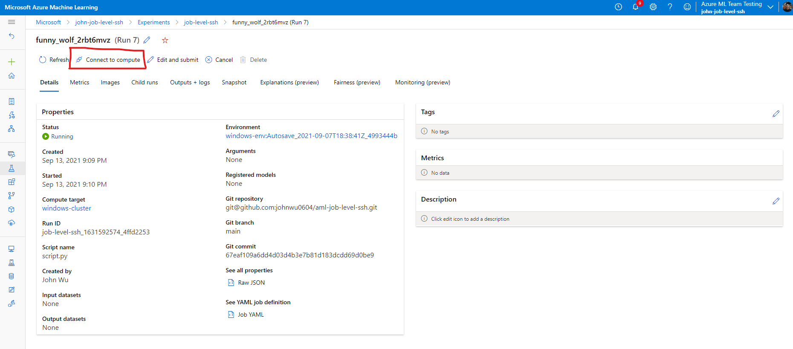
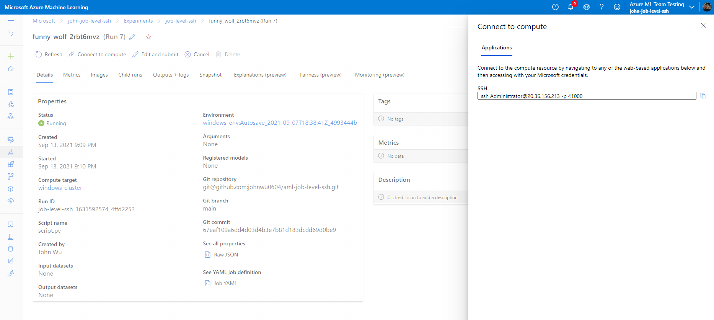

# Azure ML Job Level SSH

This repository demonstrates how to use job level SSH on Azure ML Windows clusters (private preview).

Follow the instructions below to use this feature:

## 1. Create Compute Cluster

Use the below PUT request to create a new Windows cluster:

```
PUT /subscriptions/<SUBSCRIPTION ID>/resourceGroups/<RESOURCE GROUP>/providers/Microsoft.MachineLearningServices/workspaces/<WORKSPACE NAME>/computes/<CLUSTER NAME>?api-version=2019-05-01 HTTP/1.1
Host: management.azure.com
Authorization: Bearer <USER TOKEN>
Content-Type: application/json
Content-Length: 574

{
   "location":"westus2",
   "properties":{
      "computeType":"AmlCompute",
      "properties":{
         "vmSize":"Standard_DS1_v2",
         "vmPriority":"Dedicated",
         "scaleSettings":{
            "minNodeCount":0,
            "maxNodeCount":10,
            "nodeIdleTimeBeforeScaleDown":"PT120S"
         },
         "remoteLoginPortPublicAccess":"Enabled",
         "userAccountCredentials":{
            "adminUserName":"myusername",
            "adminUserPassword":"MyPassword123"
         },
         "subnet": {
            "id": "/subscriptions/xxxx/resourceGroups/xxx/providers/Microsoft.Network/virtualNetworks/xxx/subnets/default" // must be same region as the cluster
         },
         "OsType":"Windows"
      }
   }
}
```

## 2. Add NSG Rules

Make sure the following rules are included in your virtual network NSG:

- Allow inbound CorpNetPublic access with priority lower than 180

```
az network nsg rule create -g <RESOURCE GROUP> --nsg-name <NAME OF THE NSG> -n CorpNetPublic --priority 103 --source-address-prefixes CorpNetPublic --destination-port-ranges 4100 --access Allow --protocol Tcp 
```

- Allow inbound Batch Node Management access

```
az network nsg rule create -g <RESOURCE GROUP> --nsg-name <NAME OF THE NSG> -n BatchNodeManagement --priority 110 --source-address-prefixes BatchNodeManagement --destination-port-ranges 29876-29877 --access Allow --protocol Tcp 
```

- Allow inbound Azure Machine Learning access

```
az network nsg rule create -g <RESOURCE GROUP> --nsg-name <NAME OF THE NSG GROUP> -n AzureMachineLearning --priority 111 --source-address-prefixes AzureMachineLearning --destination-port-ranges 44224 --access Allow --protocol Tcp 
```


## 3. Install Latest Azure ML SDK Version

Install the latest Azure ML SDK version (1.34.0 or higher) using pip:

```
pip install azureml-sdk==1.34.0
```

You can also build a new conda environment by using the attached *env.yml* file:

```
conda env create -f env.yml
```

## 4. Submit Job

Run the sample [submit.py](./submit.py) file to submit a job with job level SSH:

```
python submit.py
```

More specifically, make sure that the appropriate windows base image is used.

```
env.docker.base_image = 'mcr.microsoft.com/azureml/3.5dotnet-ltsc2019:latest'
```

And make sure your SSH public key is included in the run configuration.

```
run_config.services['SSH'] = ApplicationEndpointConfiguration(
    type='SSH',
    properties={'sshPublicKeys': '<SSH PUBLIC KEY'}
)  
```


## 5. Connect to compute

Go to the run details view for the job and click **Connect to compute** action button at the top. 



Copy the provided connection string and use it to SSH into the node.

